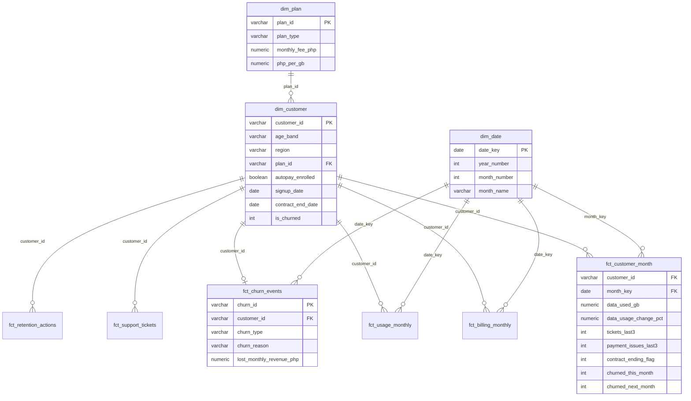

# Warehouse Schema — ERD & Data Dictionary

## Star Schema (Gold layer)

Design notes:

- **Natural keys** (customer_id, plan_id) are used instead of surrogate keys —
  appropriate at this scale with a single source system. Revisit if multiple
  source systems or SCD-2 history are introduced.
- **Month grain** for usage/billing keeps the platform focused on the churn
  decision cycle (telecom retention operates monthly) and keeps data volumes
  trainable on a laptop.
- `dim_location`, `dim_device`, `dim_channel` are small conformance dims; their
  attributes are also denormalized onto `dim_customer` for query convenience.

## Bronze (raw) Tables

### raw.customers — one row per subscriber
| Column | Type | Description |
|---|---|---|
| customer_id | varchar PK | `CUST-NNNNNN` |
| age, gender | int, char | Demographics |
| region, city | varchar | PH region and city |
| plan_id | varchar FK | Current plan |
| device_brand, device_tier | varchar | Handset brand; budget/mid/premium |
| acquisition_channel | varchar | retail_store / online / telesales / dealer / app |
| autopay_enrolled, email_opt_in | boolean | Account settings |
| signup_date | date | Activation date |
| contract_start_date, contract_end_date | date | Null for prepaid |

### raw.plans — one row per plan
| Column | Type | Description |
|---|---|---|
| plan_id | varchar PK | `PLN-NNN` |
| plan_name, plan_type | varchar | prepaid / postpaid |
| monthly_fee_php | numeric | Monthly recurring fee |
| data_allowance_gb, voice_minutes, sms_allowance | numeric | Plan inclusions (99999 = unlimited) |
| contract_months | int | 0 / 12 / 24 |

### raw.billing — one invoice per customer-month
| Column | Type | Description |
|---|---|---|
| invoice_id | varchar PK | `INV-NNNNNNN` |
| customer_id, billing_month | FK, date | Grain |
| plan_fee_php, overage_php, total_amount_php | numeric | Overage billed at ₱12/GB |
| payment_status | varchar | paid / late / unpaid |
| paid_date | date | Null when unpaid |

### raw.network_usage — one row per customer-month
| Column | Type | Description |
|---|---|---|
| usage_id | varchar PK | |
| customer_id, usage_month | FK, date | Grain |
| data_used_gb, voice_minutes_used, sms_sent | numeric | Consumption |
| avg_download_mbps, dropped_call_rate | numeric | Network quality experienced |

### raw.support_tickets — one row per ticket
| Column | Type | Description |
|---|---|---|
| ticket_id | varchar PK | |
| customer_id, opened_date | FK, date | |
| channel | varchar | hotline / app / store / social |
| category | varchar | network_quality / billing_dispute / service_request / account_issue |
| priority | varchar | low / medium / high |
| resolved_date, csat_score | date, int | CSAT 1–5, null if not surveyed |

### raw.retention_actions — one row per campaign touch
| Column | Type | Description |
|---|---|---|
| action_id | varchar PK | |
| customer_id, action_date | FK, date | |
| campaign_name | varchar | `RETAIN-YYYYMM` |
| action_type | varchar | discount_offer / plan_upgrade / loyalty_reward / winback_call |
| offer_value_php, accepted | numeric, boolean | |

### raw.churn_events — at most one row per customer
| Column | Type | Description |
|---|---|---|
| churn_id | varchar PK | |
| customer_id | varchar FK, unique | |
| churn_date, churn_month | date | |
| churn_type | varchar | voluntary / involuntary |
| churn_reason | varchar | contract_expired / poor_service_experience / reduced_engagement / price_dissatisfaction / competitor_switch / non_payment |
| last_plan_id, tenure_months_at_churn | varchar, int | |

## Gold: fct_customer_month (the analytical spine)

Grain: **one row per customer per active month** (tested). The Phase 3
training set and every KPI derive from this table.

| Column | Description |
|---|---|
| customer_id, month_key | Grain |
| tenure_months | Months since signup |
| contract_ending_flag | 1 if contract ends within ±1 month |
| data_used_gb, voice_minutes_used, sms_sent | Consumption |
| data_used_gb_prev3_avg, data_usage_change_pct | Usage trend vs trailing 3-month avg |
| total_amount_php, overage_php | Billing |
| is_payment_issue, is_unpaid, payment_issues_last3 | Payment behavior |
| tickets_opened, high_priority_tickets, tickets_last3, avg_csat | Support friction |
| retention_actions, retention_accepted | Campaign exposure |
| churned_this_month, churn_type, churn_reason | Outcome |
| **churned_next_month** | **ML label** — null on each customer's final observed month (no lookahead); exclude nulls from training |
